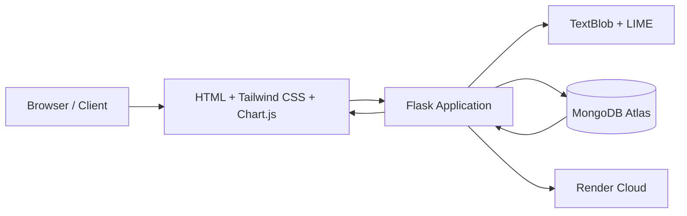

<div align="center">

# 🧠 Sentiment Analysis Web App with LIME Explainability

A full-stack Flask web application for sentiment analysis with secure authentication, MongoDB persistence, and **LIME-based model interpretability**.

**Live Demo:** 👉 https://mm-2-p6uy.onrender.com/


</div>

---

## 📌 Overview

This **Sentiment Analysis Web App** allows users to analyze text sentiment using **TextBlob**, understand predictions through **LIME explanations**, and track their sentiment history over time.

The application is built using **Flask** for the backend, **MongoDB Atlas** for persistence, and a modern UI powered by **Tailwind CSS**, **Chart.js**, and **Particles.js**.

---

## ✨ Features

- 🔐 **User Authentication**
  - Register, Login, Logout
- 💬 **Sentiment Analysis**
  - Positive / Negative / Neutral classification using TextBlob
- 🔍 **Explainable AI (XAI)**
  - LIME explanations highlighting influential words
- 📊 **Interactive Charts**
  - Bar / Pie charts for sentiment distribution
- 🗂 **History Tracking**
  - View previous analyses with explanations
- 📤 **CSV Export**
  - Download sentiment history as CSV
- 👮 **Admin Dashboard**
  - View and delete all user submissions
- 🎨 **Modern UI**
  - Tailwind CSS + Particles.js

---

## 🚀 Live Application

🌐 **Production URL:**  
👉 https://mm-2-p6uy.onrender.com/

---

## 🛠 Tech Stack

| Layer | Technologies |
|------|-------------|
| Frontend | HTML, Tailwind CSS, Chart.js, Jinja2 |
| Backend | Flask (Python) |
| ML / XAI | TextBlob, Scikit-learn, LIME |
| Database | MongoDB Atlas |
| Deployment | Render (Gunicorn) |

---

## 📁 Project Structure

```

mm/
├── app.py                  # Main Flask application
├── templates/              # HTML templates
│   ├── index.html
│   ├── login.html
│   ├── register.html
│   ├── results.html
│   ├── history.html
│   └── admin.html
├── static/                 # CSS, JS, assets
├── requirements.txt        # Python dependencies
├── Procfile                # Gunicorn start command
├── .env.example            # Environment variable template
└── README.md               # Documentation

````

---

## ⚙️ Environment Variables

Create a `.env` file in the project root:

```env
SECRET_KEY=your_secret_key
MONGODB_URI=mongodb+srv://<user>:<password>@cluster.mongodb.net/sentimentDB
ADMIN_EMAIL=admin@example.com
````

> ⚠️ **Do not commit `.env` to GitHub**
> Use `.gitignore` to protect secrets.

---

## 🧪 Local Setup

```bash
# Clone repository
git clone https://github.com/kuppireddybhageerathareddy1110/mm.git
cd mm

# Create virtual environment
python -m venv venv
venv\Scripts\activate   # Windows
# source venv/bin/activate  # Linux/Mac

# Install dependencies
pip install -r requirements.txt

# Run application
python app.py
```

Visit:
👉 [http://127.0.0.1:5000](http://127.0.0.1:5000)

---

## 🧠 Explainable AI with LIME

The app uses **LIME (Local Interpretable Model-Agnostic Explanations)** to:

* Highlight words contributing to sentiment predictions
* Provide transparent, human-understandable explanations
* Improve trust in ML decisions

> To ensure production stability, LIME explanations are generated **only when sufficient sentiment class diversity exists**.

---

## 📊 Charts & Analytics

* Sentiment distribution visualized using **Chart.js**
* Supports:

  * Bar Chart
  * Pie Chart
* Filters:

  * Entry limit
  * Sorting
  * Date range

---

## 👮 Admin Dashboard

* Accessible only to the email specified in `ADMIN_EMAIL`
* Features:

  * View all user submissions
  * Delete inappropriate or test entries

---

## 🧯 Production Stability

* Safe handling of single-class ML data
* No model training crashes in production
* Graceful fallback when LIME explanations are unavailable

---

## 🌱 Future Enhancements

* Multilingual sentiment support
* Transformer models (BERT)
* Pagination for history
* User analytics dashboard
* OAuth login (Google / GitHub)

---

## 📝 License

This project is licensed under the **MIT License**.

---

## 👤 Author

**Kuppireddy Bhageeratha Reddy**

* GitHub: [https://github.com/kuppireddybhageerathareddy1110](https://github.com/kuppireddybhageerathareddy1110)
* Live App: [https://mm-2-p6uy.onrender.com/](https://mm-2-p6uy.onrender.com/)

---

<div align="center">

Built with ❤️ using **Flask, MongoDB, and Explainable AI**

⭐ Star the repository if you find it useful

</div>
```

---

# 🏗️ Architecture Diagram

Add this section **after the “Tech Stack” section**.

---

## 🏗️ System Architecture

The application follows a **classic three-tier architecture** with an explainable ML layer integrated into the backend.



### 🔍 Architecture Explanation

* **Client Layer**

  * Browser-based UI using HTML, Tailwind CSS, Chart.js, and Particles.js
  * Sends user input via HTTP requests

* **Application Layer (Flask)**

  * Handles routing, authentication, session management
  * Executes sentiment analysis logic
  * Triggers LIME explanations conditionally

* **ML / Explainability Layer**

  * **TextBlob**: Sentiment polarity calculation
  * **Scikit-learn + Logistic Regression**: Lightweight classifier for LIME
  * **LIME**: Explains word-level influence on sentiment

* **Database Layer**

  * MongoDB Atlas stores:

    * User credentials
    * Sentiment results
    * LIME HTML explanations
    * Timestamps and metadata

* **Deployment Layer**

  * Hosted on **Render**
  * Served via **Gunicorn (WSGI)**

---


